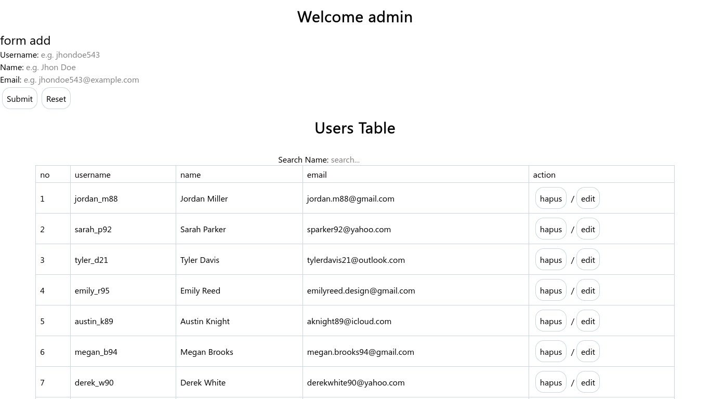

# User Manager - Learning React State

[](https://vitejs.dev)
[](https://reactjs.org)
[](https://tailwindcss.com)
[](https://tauri.app)

This project was created to learn how React manages **state**, **components**, and **context**. It also explores basic usage of **TailwindCSS v4** and integration with **Tauri** to wrap the web app into a lightweight desktop application.

---

## 📚 What I Learned

- **React Components** – Breaking the UI into small reusable pieces.
- **Local State** with `useState()` – Managing state inside a component.
- **Global State** with React Context – Sharing state across components.
- **Mapping Arrays** – Rendering lists of data into a table.
- **Filtering Arrays** – Searching data based on user input.
- **Event Handling** – `onChange`, `onClick`, and custom events.
- **TailwindCSS v4** – Rapid utility-first styling.

---

## ✨ Features Produced

- A form to add and edit user data.
- Stores user data in **global state** (React Context) that can be modified from other components.
- Delete users from the DOM and state.
- A table that dynamically displays the list of users.
- **Live search** using array filtering.
- A simple desktop application built with Tauri.

---

## 🛠️ Technologies Used

| Technology   | Description                             |
|--------------|-----------------------------------------|
| **Vite**     | Fast build tool and dev server          |
| **React**    | UI library for building interfaces      |
| **TailwindCSS** | Utility-first CSS framework          |
| **Tauri**    | Lightweight desktop wrapper (Rust-based)|

---

## 📸 Screenshot



🔗 **Live Demo:** [danydevid.github.io/frontendonly-user-manager-react](https://danydevid.github.io/frontendonly-user-manager-react)

---

## 📁 Folder Structure

```
src/
├── components/
│   ├── Form.jsx          # Handles add/edit user form
│   └── UserTable.jsx     # Renders user data + search filter logic
├── data/
│   └── users.json        # Initial data to seed the global state
├── App.jsx               # Combines components & provides context
└── main.jsx              # Application entry point
```

The structure follows standard React patterns. `App.jsx` acts as the provider of **global context**, `Form.jsx` handles input and editing, while `UserTable.jsx` displays data and applies the search filter.

---

## 🚀 How to Run the Project

### Prerequisites
- [Bun](https://bun.sh) v1.3.14 or newer
- [Rust](https://rustup.rs) (only needed for Tauri)

### Steps

```bash
# 1. Clone the repository
git clone https://github.com/danydevid/frontendonly-user-manager-react

# 2. Navigate to the project directory
cd frontendonly-user-manager-react

# 3. Install all dependencies
bun install

# 4. Run in development mode (Vite)
bun run dev
```

To run the desktop version (Tauri):

```bash
bun tauri dev
```

### Production Build

```bash
# Build the frontend (Vite)
bun run build

# Build the desktop app (Tauri)
bun tauri build
```

---

## 👨‍💻 Contact

Created by **Dany Saputra**

- 📧 Email: [study@danydevid.my.id](mailto:study@danydevid.my.id)
- 🌐 Portfolio: [portfolioos.danydevid.my.id](https://portfolioos.danydevid.my.id)

---

> This project is for learning purposes only. Feel free to use it as a reference or further develop it.